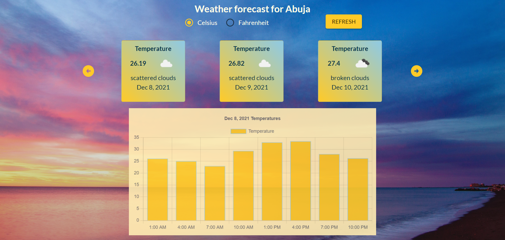
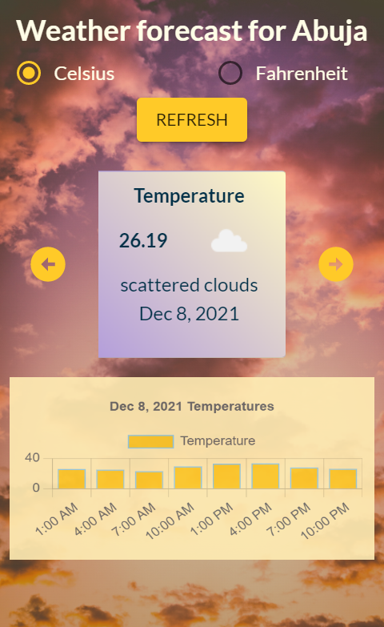

# Weather-App
> A simple web application that collects information from an API to provide weather forecast. Real live data is obtained from the OpenWeatherMap API.

### Weather App
#### Desktop

#### Mobile

## Built With

- ReactJS
- Redux
- Material UI

## Live demo

[Weather App]()

## Getting Started

### To get a local copy run the following steps:

- Clone the repository with `https://github.com/ZeenatLawal/Weather-App.git`
- Open your terminal or command line
- Run `git clone` and paste the link above
- Open the folder with your code editor
- Create a branch to work on
- Run `npm install` to install all dependencies
- Run `npm start` and go to `http:localhost:3000/` to launch the server.

## Author

👤 **Zeenat Lawal**

- GitHub: [@ZeenatLawal](https://github.com/ZeenatLawal)
- Twitter: [@lawal_zeenat](https://twitter.com/lawal_zeenat)
- LinkedIn: [Zeenat Lawal](https://www.linkedin.com/in/zeenatlawal/)

## 🤝 Contributing

Contributions, issues, and feature requests are welcome!

Feel free to check the [issues page](https://github.com/ZeenatLawal/Weather-App/issues).

## Show your support

Give a ⭐️ if you like this project!

## Acknowledgments

- The Payoneer Team
- [OpenWeatherMap API](https://openweathermap.org/api)
- [Material UI](https://material-ui.com/)
